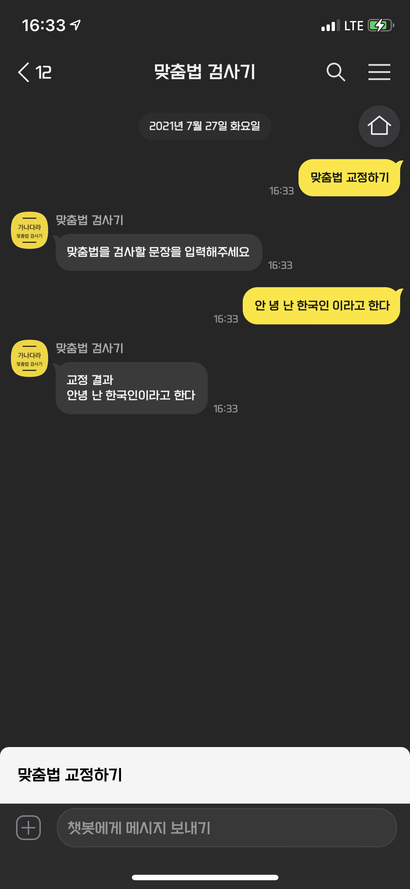

# Korean language spell check by kakao chatbot
카카오톡 챗봇으로 한국어 맞춤법 교정을 할 수 있습니다

## Description
- [kakao i open builder]를 이용해서 챗봇🤖을 구현함
- 본 서비스는 kakao chatbot의 스킬서버로 이용됨
- 네이버 맞춤법 검사기에 기반함

## Screenshot

## Links
- [카카오톡 채널][채널URL]
- [카카오톡 채팅][채팅URL]

[채널URL]:(http://pf.kakao.com/_FxcxdJs)
[채팅URL]:(http://pf.kakao.com/_FxcxdJs/chat)
[kakao i open builder]:(https://i.kakao.com/)